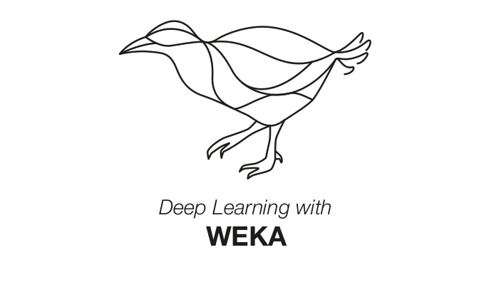
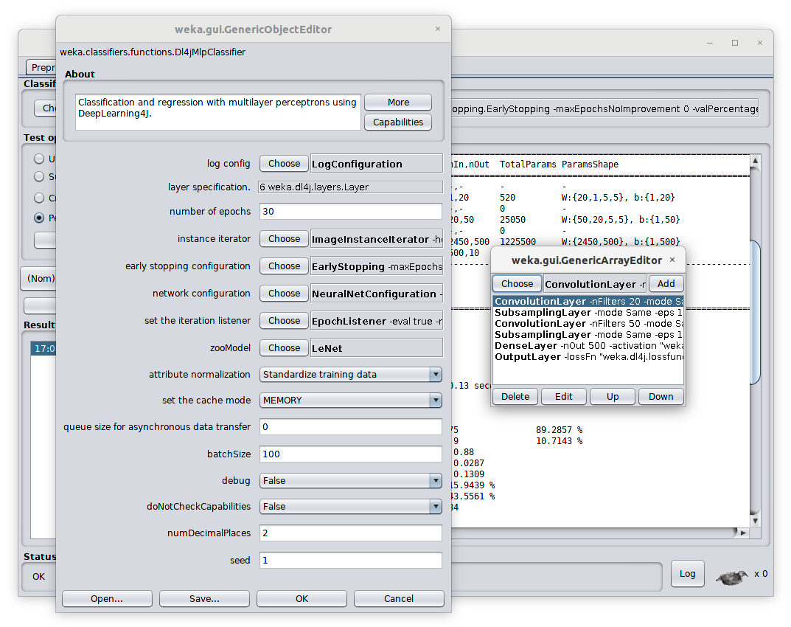

<p align="center">
     
</p>

# WekaDeeplearning4j

[](https://GitHub.com/Waikato/wekaDeeplearning4j/releases/)
[](http://perso.crans.org/besson/LICENSE.html)
[](https://travis-ci.com/Waikato/wekaDeeplearning4j)
[](https://github.com/Waikato/wekaDeeplearning4j/issues)


WekaDeeplearning4j gives users the ability to train and test deep learning models from within the Weka environment. Our goal is to make deep learning available to users with zero knowledge of programming. The package uses Deeplearning4j as backend. Weka, and therefore also the WekaDeeplearning4j package, can be accessed via various interfaces. While the main focus of this package is the Weka GUI for users with no programming experience, it is also possible to access the presented features via the Weka commandline line runner as well as from the Weka Java API. Check out the [getting-started](https://deeplearning.cms.waikato.ac.nz/user-guide/getting-started/) tutorials for more information.

The full documentation, giving installation instructions and getting started guides, is available [here](https://deeplearning.cms.waikato.ac.nz/).



## Installation
The package can be installed via the [Weka Package Manager](https://waikato.github.io/weka-wiki/packages/manager/) GUI. 

Alternatively, the [latest release](https://github.com/Waikato/wekaDeeplearning4j/releases/latest) on GitHub provides the zip file of the package that allow easy installation via the commandline:

```bash
java -cp weka.jar weka.core.WekaPackageManager \
     -install-package package.zip
```

### GPU Support

To add GPU support, [download](https://github.com/Waikato/wekaDeeplearning4j/releases/latest) and run the latest `install-cuda-libs.sh` for Linux/Macosx or `install-cuda-libs.ps1` for Windows. Make sure CUDA is installed on your system as explained [here](https://deeplearning.cms.waikato.ac.nz/install/#gpu).

#### Manual Download

The install script automatically downloads the libraries and copies them into your wekaDeeplearning4j package installation. If you want to download the library zip yourself, choose the appropriate combination of your platform and CUDA version from the [latest release](https://github.com/Waikato/wekaDeeplearning4j/releases/latest) and point the installation script to the file, e.g.:

```bash
./install-cuda.sh ~/Downloads/wekaDeeplearning4j-cuda-10.2-1.60-linux-x86_64.zip
```

## Usage
As most of Weka, WekaDeeplearning4j's functionality is accessible in three ways:

- Using the Weka workbench GUI
- Programming with Weka in Java
- Via the commandline interface

All three ways are explained in the [getting-started](https://deeplearning.cms.waikato.ac.nz/user-guide/getting-started/) documentation. 

Example commandline scripts are provided in the `weka-run-test-scripts` directory, e.g. a simple network with one dense layer of 32 neurons and one output layer, classifying the iris dataset, would look like the following:
```bash
$ java weka.Run \
       .Dl4jMlpClassifier \
       -layer "weka.dl4j.layers.DenseLayer -nOut 32 -activation \"weka.dl4j.activations.ActivationReLU \" " \
       -layer "weka.dl4j.layers.OutputLayer -activation \"weka.dl4j.activations.ActivationSoftmax \" " \
       -numEpochs 30 \
       -t datasets/nominal/iris.arff
```

which results in:

```
=== Stratified cross-validation ===

Correctly Classified Instances         141               94      %
Incorrectly Classified Instances         9                6      %
Kappa statistic                          0.91  
Mean absolute error                      0.0842
Root mean squared error                  0.1912
Relative absolute error                 18.9359 %
Root relative squared error             40.5586 %
Total Number of Instances              150     


=== Detailed Accuracy By Class ===

                 TP Rate  FP Rate  Precision  Recall   F-Measure  MCC      ROC Area  PRC Area  Class
                 1.000    0.000    1.000      1.000    1.000      1.000    1.000     1.000     Iris-setosa
                 0.880    0.030    0.936      0.880    0.907      0.864    0.978     0.928     Iris-versicolor
                 0.940    0.060    0.887      0.940    0.913      0.868    0.979     0.972     Iris-virginica
Weighted Avg.    0.940    0.030    0.941      0.940    0.940      0.911    0.986     0.967     


=== Confusion Matrix ===

  a  b  c   <-- classified as
 50  0  0 |  a = Iris-setosa
  0 44  6 |  b = Iris-versicolor
  0  3 47 |  c = Iris-virginica
```

The same setup can be achieved in Java with the following code:
```java
// Setup layers
DenseLayer dense = new DenseLayer();
dense.setNOut(32);
OutputLayer out = new OutputLayer();
        
// Setup MLP
Dl4jMlpClassifier mlp = new Dl4jMlpClassifier();
mlp.setLayers(dense, out);
        
// Build model
mlp.buildClassifier(loadIris());
```

## Documentation
The full documentation, giving installation instructions and getting started guides, is available at [https://deeplearning.cms.waikato.ac.nz/](https://deeplearning.cms.waikato.ac.nz/).

The java documentation can be found [here](https://waikato.github.io/wekaDeeplearning4j/).

## Contributing

If you want to contribute to the project, check out the [contributing guide](./CONTRIBUTING.md).

## Development 

Check out [DEVELOPMENT.md](./DEVELOPMENT.md) for further information.


## Citation

Please cite the following paper if using this package in an academic publication:

S. Lang, F. Bravo-Marquez, C. Beckham, M. Hall, and E. Frank  [WekaDeeplearning4j: a Deep Learning Package for Weka based on  DeepLearning4j](https://www.sciencedirect.com/science/article/pii/S0950705119301789),  In *Knowledge-Based Systems*, Volume 178, 15 August 2019, Pages 48-50. DOI: 10.1016/j.knosys.2019.04.013  ([author version](https://felipebravom.com/publications/WDL4J_KBS2019.pdf))


BibTex:

```
@article{lang2019wekadeeplearning4j,
  title={WekaDeeplearning4j: A deep learning package for Weka based on Deeplearning4j},
  author={Lang, Steven and Bravo-Marquez, Felipe and Beckham, Christopher and Hall, Mark and Frank, Eibe},
  journal={Knowledge-Based Systems},
  volume = "178",
  pages = "48 - 50",
  year = "2019",
  issn = "0950-7051",
  doi = "https://doi.org/10.1016/j.knosys.2019.04.013",
  url = "http://www.sciencedirect.com/science/article/pii/S0950705119301789",
  publisher={Elsevier}
}

```


## Misc.
Original code by Mark Hall
