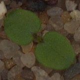
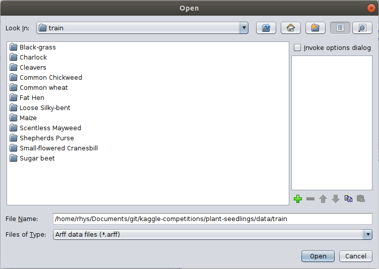
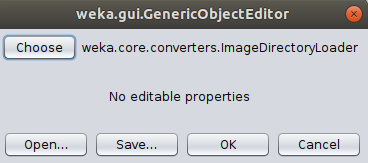
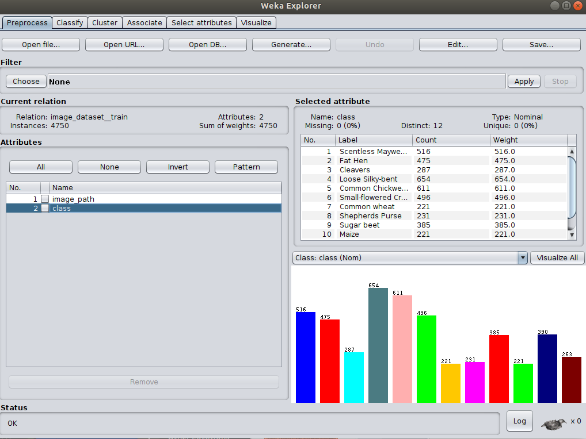
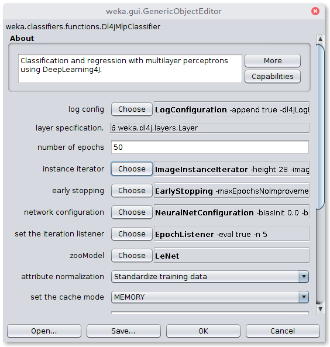
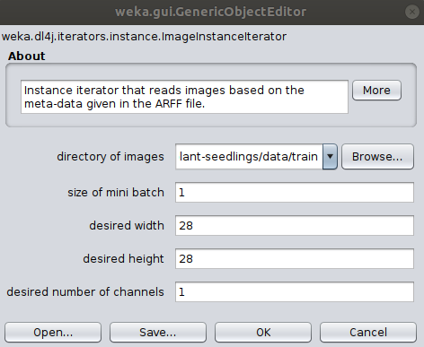
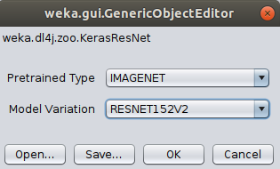

# Classify Your Own Dataset
  



This tutorial will walk through the steps required to finetune a pretrained model on your custom dataset.

The dataset used in this tutorial is from the [Plant Seedlings Classification](https://www.kaggle.com/c/plant-seedlings-classification) competition on Kaggle. Visit the link to download the dataset.

### Creating the Meta ARFF File (`ImageDirectoryLoader`)
This dataset is uses a common 'folder organised' format - images are sorted into subfolders, with the class name being the subfolder name. This format is intuitive and easy to work with but cannot be loaded directly into WEKA without further processing.

WekaDeeplearning4j now comes with the `ImageDirectoryLoader`, a simple tool which creates an `.arff` file from a 'folder organised' dataset.

#### GUI Usage
The `ImageDirectoryLoader` can be invoked by selecting a **folder** instead of a **file** from the
`Open file...` menu.

Click `Open File...` and navigate to the `train/` folder in the Plant Seedlings dataset
you just downloaded.



Click `Ok` and choose the `ImageDirectoryLoader` in the following popup.



There are no settings to change so simply click `OK` to run - you should be taken back to the 
`Preprocess` panel with your instances now loaded.



#### Commandline Usage
The tool can also be run from the command line
```bash
java weka.Run .ImageDirectoryLoader -i <input dataset path> -name <output arff filename>
```
e.g.:
```bash
java weka.Run .ImageDirectoryLoader -i /path/to/plant-seedlings/data/train -name plant-seedlings-train.arff
```

The associated meta `.arff` file has been created inside the input directory specified. As we're simply checking accuracy within WEKA, we won't load in the `test/` data and submit it to Kaggle - that is outside the scope of this tutorial.

**Important note:** The newly created arff dataset contains two features, the first one being the `filename` and the second one being the `class`. Therefore it is necessary to define an `ImageInstanceIterator` (in `Dl4jMlpFilter` or `Dl4jMlpClassifier`) which uses these filenames in the directory given by the option `-imagesLocation`.


## Training - GUI

The first step is to open the plant seedlings instances as shown earlier. 
In the next step, the `Dl4jMlpClassifier` has to be selected as `Classifier` in the `Classify` tab. A click on the classifier will open the configuration window



To correctly load the images it is further necessary to select the `Image-Instance-Iterator` as `instance iterator` 
and set the `images location` to the `train/` directory in the Plant Seedlings dataset folder.
We'll be using a pretrained model (which has a fixed input size) so the width, height, and number of channels don't need to be set. 



For the sake of this tutorial, we'll use a pretrained Keras ResNet152V2 model. Select `KerasResNet` from the `zooModel` option.
The default variation is `RESNET50`, so we'll change that to `RESNET152V2`.



Note that by default, the layer specification is **not** loaded in the GUI for usability reasons;
loading the layers every time an option is changed can slow down the GUI significantly. If, however, you'd like
to view the layers of the zoo model you've selected, set the `Load layer specification in GUI` flag to true.

A holdout evaluation strategy has to be selected in the `Test options` box via `Percentage split`, 
which can be set to 66% for a 2/3 - 1/3 split. The classifier training is now ready to be started with the `Start` button. 
The resulting classifier evaluation can be examined in the `Classifier output` box. Here, an evaluation summary is shown for the training and testing split. 

The above setup, trained for 20 epochs with a batch size of 16 produces a classification accuracy of 94.51% on the
 test data.

```text

Correctly Classified Instances        1497               94.5076 %
Incorrectly Classified Instances        87                5.4924 %
Kappa statistic                          0.9392
Mean absolute error                      0.01  
Root mean squared error                  0.0894
Relative absolute error                  6.6502 %
Root relative squared error             32.5587 %
Total Number of Instances             1584     

=== Confusion Matrix ===

   a   b   c   d   e   f   g   h   i   j   k   l   <-- classified as
  44   0   0   0   6   0  38   0   0   0   0   0 |   a = Black-grass
   0 128   0   0   0   1   0   0   0   1   0   0 |   b = Charlock
   0   0  92   2   0   0   0   0   0   0   0   2 |   c = Cleavers
   0   1   0 202   0   0   1   0   0   0   0   0 |   d = Common Chickweed
   2   0   0   0  69   0   2   0   0   0   0   1 |   e = Common wheat
   1   0   1   0   1 154   0   0   0   0   0   1 |   f = Fat Hen
  11   0   0   0   0   0 206   0   1   0   0   0 |   g = Loose Silky-bent
   0   0   0   0   0   0   3  71   0   0   0   0 |   h = Maize
   1   0   0   0   0   0   0   0 171   0   0   0 |   i = Scentless Mayweed
   0   0   0   1   0   0   0   0   5  71   0   0 |   j = Shepherds Purse
   0   0   0   0   0   0   1   0   0   0 164   0 |   k = Small-flowered Cranesbill
   0   1   0   2   0   0   0   0   0   0   0 125 |   l = Sugar beet
```


## Training - Commandline
Ensure `weka.jar` is on the classpath. The following run finetunes a pretrained ResNet model for 20 epochs. This shows how to specify a non-default variation from the command line.
```bash
$ java weka.Run \
    .Dl4jMlpClassifier \
    -S 1 \
    -iterator ".ImageInstanceIterator -imagesLocation plant-seedlings/data/train -bs 16" \
    -normalization "Standardize training data" \
    -zooModel ".KerasResNet -variation RESNET152V2" \
    -config "weka.dl4j.NeuralNetConfiguration -updater \"weka.dl4j.updater.Adam -lr 0.1\"" \
    -numEpochs 20 \
    -t plant-seedlings/data/train/plant-seedlings-train.arff \
    -split-percentage 66
```

## Java
The same architecture can be built programmatically with the following Java code

```java
// Load all packages so that Dl4jMlpFilter class can be found using forName("weka.filters.unsupervised.attribute.Dl4jMlpFilter")
weka.core.WekaPackageManager.loadPackages(true);

// Load the dataset
weka.core.Instances data = new weka.core.Instances(new FileReader("/home/rhys/Documents/git/kaggle-competitions/plant-seedlings/data/train/output.arff"));
data.setClassIndex(data.numAttributes() - 1);
String[] classifierOptions = weka.core.Utils.splitOptions("-iterator \".ImageInstanceIterator -imagesLocation /home/rhys/Documents/git/kaggle-competitions/plant-seedlings/data/train -bs 16\" -zooModel \"weka.dl4j.zoo.KerasResNet -variation RESNET152V2\" -config \"weka.dl4j.NeuralNetConfiguration -updater \\\"weka.dl4j.updater.Adam -lr 0.1\\\"\" -numEpochs 20");
weka.classifiers.AbstractClassifier myClassifier = (AbstractClassifier) weka.core.Utils.forName(weka.classifiers.AbstractClassifier.class, "weka.classifiers.functions.Dl4jMlpClassifier", classifierOptions);

// Stratify and split the data
Random rand = new Random(0);
Instances randData = new Instances(data);
randData.randomize(rand);
randData.stratify(5);
Instances train = randData.trainCV(5, 0);
Instances test = randData.testCV(5, 0);

// Build the classifier on the training data
myClassifier.buildClassifier(train);

// Evaluate the model on test data
Evaluation eval = new Evaluation(test);
eval.evaluateModel(myClassifier, test);

// Output some summary statistics
System.out.println(eval.toSummaryString());
System.out.println(eval.toMatrixString());
```
