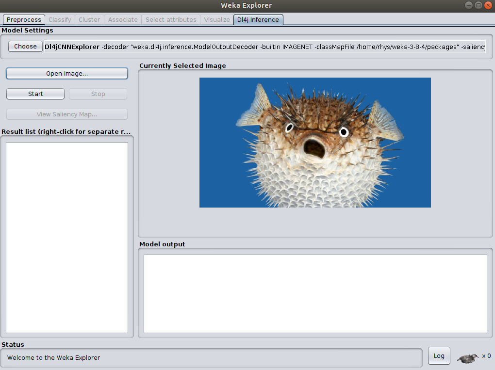
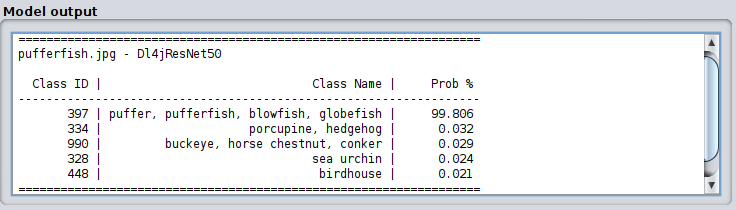
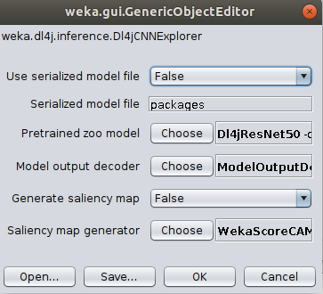
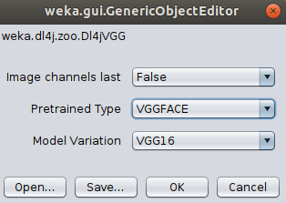
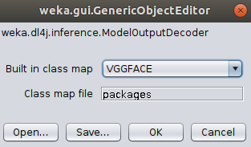
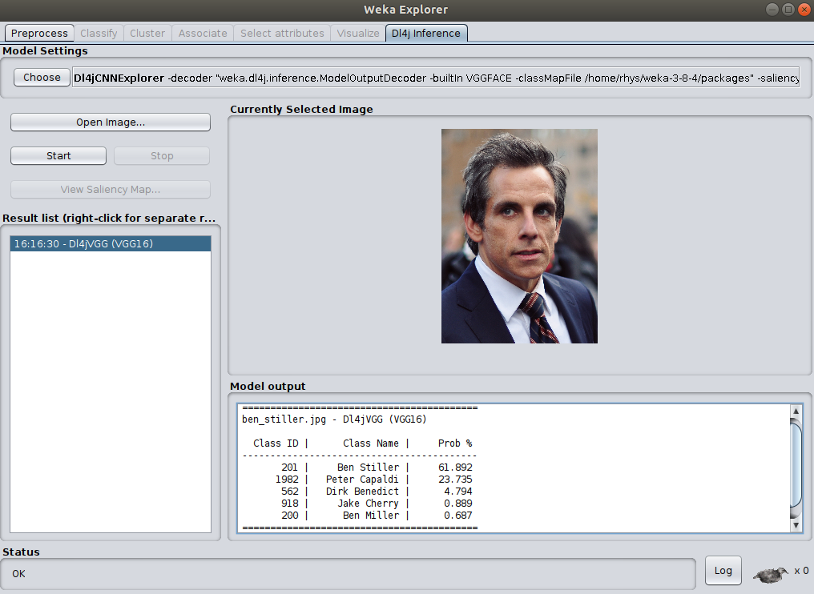
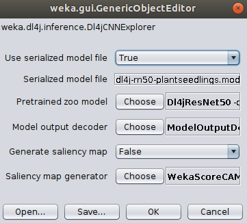
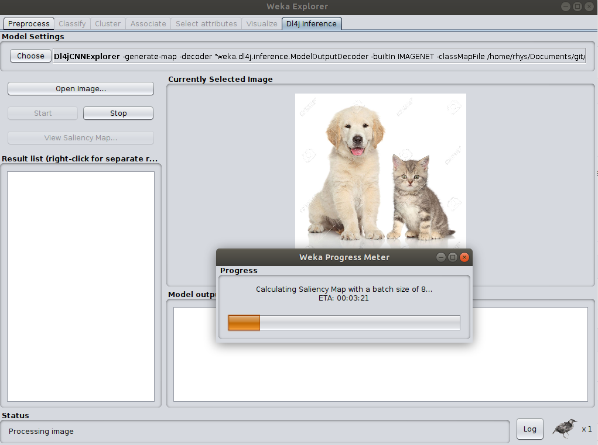
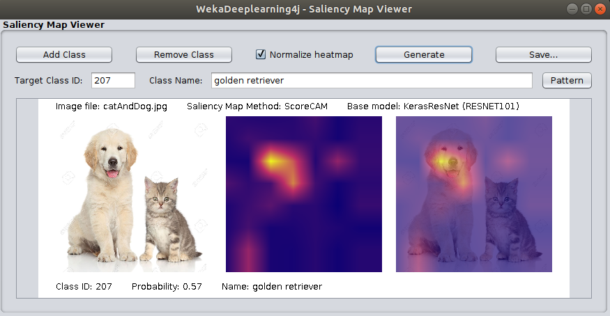
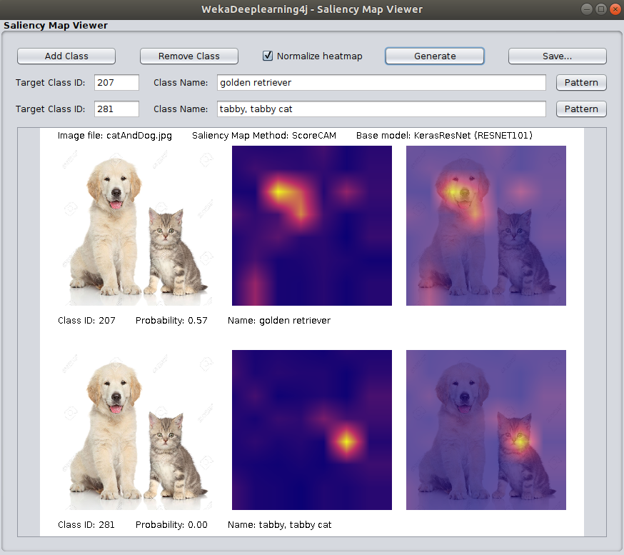

# Dl4j Model Inference Panel

WekaDeeplearning4j includes a new `Dl4j Inference` panel, which allows you to easily
run inference on images using either the built-in [Model Zoo](../user-guide/model-zoo.md)
or a custom trained `Dl4jMlpClassifier` model. This panel doesn't require you to load 
an entire `.arff` dataset, so it's great for quick experimentation and prototyping.

For more in-depth experimentation, WekaDeeplearning4j allows you to generate a **saliency map**
when running inference on an image. The map can show *what part of the image the model is 'looking'
at to make its prediction*.

This tutorial walks through a few common usage scenarios with the panel, including simple 
inference and more advance **saliency map** generation.

Where the examples below use an image, this can be found at:

    $WEKA_HOME/packages/wekaDeeplearning4j/src/test/resources/images/ 

## Example 1: Simple Inference with Default Parameters

The package has set reasonable default values for simple inference on images of everyday objects
(animals, food, vehicles, etc.) This example uses the built-in `Dl4jResNet50` model (pretrained
 on IMAGENET) to perform prediction on your image.

### GUI

After switching to the `Dl4j Inference` panel, we'll need to open an image 
to run prediction on. We'll use `pufferfish.jpg` for this example (see above for full path),
although you can use any image saved to your machine.



To run inference on the image, simply click `Start`. After a brief pause you should see the
prediction results below the image:



As we can see the model (`Dl4jResNet50`) has successfully predicted the image as that of a **Pufferfish**!

### Command Line

```shell script
$ java weka.Run .Dl4jCNNExplorer -i src/test/resources/images/pufferfish.jpg
```

```shell script
==================================================================
pufferfish.jpg - Dl4jResNet50

  Class ID |                              Class Name |     Prob %
------------------------------------------------------------------
       397 | puffer, pufferfish, blowfish, globefish |     99.806
       334 |                     porcupine, hedgehog |      0.032
       990 |         buckeye, horse chestnut, conker |      0.029
       328 |                              sea urchin |      0.024
       448 |                               birdhouse |      0.021
==================================================================
```

### Java

```java

```

## Example 2: Simple Inference with Custom Parameters

The previous example showed how with absolutely no configuration we can run a pretrained deep learning
model, but we may want to configure the model a little further. This example shows how to use
the `VGG16` model (pretrained on the `VGGFACE` dataset) to perform **celebrity prediction**.

For the purposes of this tutorial, we'll use an image of **Ben Stiller** (`ben_stiller.jpg`) 
to perform prediction on.

On the `Dl4j Inference` panel, open the `Dl4jCNNExplorer` settings:



- Choose `Dl4jVGG` as the `Pretrained zoo model`.
    - Open the `Dl4jVGG` settings and change the `Pretrained Type` from `IMAGENET` to `VGGFACE`.
- Open the `ModelOutputDecoder` settings and change `Built in class map` from `IMAGENET` to `VGGFACE`.





- Click `Ok` and `Start` to run the newly configured model on our image of Ben Stiller. You should
see the results in the output panel, again correctly predicting the target class.



### Command Line

```shell script
$ java weka.Run .Dl4jCNNExplorer \
    -decoder ".ModelOutputDecoder -builtIn VGGFACE" \
    -zooModel ".Dl4jVGG -variation VGG16 -pretrained VGGFACE" \
    -i src/test/resources/images/ben_stiller.jpg
```

```shell script
==========================================
ben_stiller.jpg - Dl4jVGG (VGG16)

  Class ID |      Class Name |     Prob %
------------------------------------------
       201 |     Ben Stiller |     61.892
      1982 |   Peter Capaldi |     23.735
       562 |   Dirk Benedict |      4.794
       918 |     Jake Cherry |      0.889
       200 |      Ben Miller |      0.687
==========================================
```

### Java

```java

```

## Example 3: Simple Inference with Custom Trained Model

Although a very diverse dataset (IMAGENET) was used to train many of the built-in zoo models 
(meaning they can perform accurate prediction in a wide range of domains), 
you may instead have a custom-trained `Dl4jMlpClassifier` which you'd like to experiment with; 
the process is largely the same as above, with a few minor changes.

### GUI

On the `Dl4j Inference` panel, open the `Dl4jCNNExplorer` settings:
- Set `Use serialized model file` to `True`
- Select your `.model` file as the `Serialized model file`
- Open the `ModelOutputDecoder` settings:
    - Set `Built in class map` to `CUSTOM`
    - Select the `Class map file` on your machine. This can be in two forms:
        - `.txt` - Each class is placed on a new line (example below)
        - `.arff` - The `.arff` file used to train the model can be selected; 
        the classes will be parsed from this.

*Sample `classmap.txt` for the Plant Seedlings dataset*
```text
Scentless Mayweed
Fat Hen
Cleavers
Loose Silky-bent
Common Chickweed
Small-flowered Cranesbill
Common wheat
Shepherds Purse
Sugar beet
Maize
Charlock
Black-grass
```




Just like the previous examples, the custom model can perform inference on any image, although 
for meaningful results you should run it on images in the domain it was trained on - a model trained
to classify between different dog breeds isn't going to give accurate answers when given a chest x-ray!

### Command Line

```shell script
$ java weka.Run .Dl4jCNNExplorer \
    -decoder ".ModelOutputDecoder -builtIn CUSTOM -classMapFile /path/to/classmap.txt" \
    -model-file /path/to/saved/model/Dl4jMlpClassifier.model \
    -use-model-file
    -i /path/to/input/image.png
```

### Java

```java

```

## Example 4: Saliency Map Generation

After running prediction on your image, you may be left wondering what *specifically* the model was
looking at to make its prediction - a saliency map can help explain this.

WekaDeeplearning4j currently contains the **ScoreCAM** saliency map generation technique,
which essentially copies the original image hundreds of times, masks each image differently,
measures how strong the model predicts the target class for each masked image, and uses this
to create a weighted combination. The idea being that masked images showing *important* parts of the 
image will produce a strong signal for the target class and therefore be weighted more heavily.

Because the model must perform inference on hundreds of images, the process can take much longer
than simple prediction (2-3 minutes). This can be sped up with the use of a modern GPU 
([setup instructions](../install.md#add-gpu-support))

For the purpose of this tutorial, we'll use **ResNet 101** to perform prediction and 
generate the saliency map.

### GUI

- In the `Dl4jCNNExplorer` settings, **set `Generate Saliency Map` to `true`**.
- Set `Use serialized model file` to `False`
- Open the `WekaScoreCAM` settings and set `Batch size` to 8 (or your number of CPU cores).
    - This allows **batches** of masked images to be passed through the model, decreasing
    saliency map generation time.
- Choose `KerasResNet` as the `Pretrained zoo model` and set the `Model Variation` to `RESNET101`.
- Ensure the `ModelOutputDecoder` is using `IMAGENET` as the built-in classmap.

From the tutorial image folder, open `catAndDog.jpg`, then click `Start` to begin processing.



After processing is finished, you should see the predictions in the `Model Output` panel,
and the **Saliency Map Viewer** window will automatically open (or click `View Saliency Map...`).

The default target class is the highest probability prediction (in this case `Golden Retriever`).
Click `Generate` to generate the saliency map for this target class.

The saliency map will be displayed (center) as well as superimposed on the original image (right):



As we can see, the model *is* focusing on the dog for its prediction.

#### Multiple Target Classes

The saliency map viewer allows you to select *multiple* target classes and display them alongside
each other.

- Click `Add Class` to add another target class.
- We now want to target the cat separately, so click `Pattern` and enter `.*tabby.*` to find 
the target class for a tabby cat.
    - If you know the class ID directly you can also enter that in the `Target Class ID` field.
    (or check the [class map lookup tables](#class-map-lookup-tables))
- Click `Generate` to create saliency maps for both classes:



As we can see, the model is correctly looking at either animal to make its prediction, depending
on whether we're targeting the dog or cat!

##### Class Map Lookup Tables

- [IMAGENET](../user-guide/class-maps/IMAGENET.md)
- [IMAGENET - Darknet 19](../user-guide/class-maps/DARKNET_IMAGENET.md) - Darknet19 was pretrained 
on an altered version of IMAGENET, hence the different class map.
- [VGGFACE](../user-guide/class-maps/VGGFACE.md)

### Command Line

To generate a saliency map from the command line, you must specify an output image location.
Note that we can also use `-1` to specify the target class. The saliency map generator
will simply use the max probability class as the target class; this is useful when you don't 
know what the class ID may be.

```shell script
$ java weka.Run .Dl4jCNNExplorer \
    -i "src/test/resources/images/catAndDog.jpg" \
    -generate-map \
    -saliency-map ".WekaScoreCAM -bs 8 -normalize -output output_image.png -target-classes -1" \
    -zooModel ".KerasResNet -variation RESNET101"
```

#### Multiple Classes

```shell script
$ java weka.Run .Dl4jCNNExplorer \
    -i "src/test/resources/images/catAndDog.jpg" \
    -generate-map \
    -saliency-map ".WekaScoreCAM -bs 8 -normalize -output output_image.png -target-classes -1,281" \
    -zooModel ".KerasResNet -variation RESNET101"
```