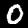
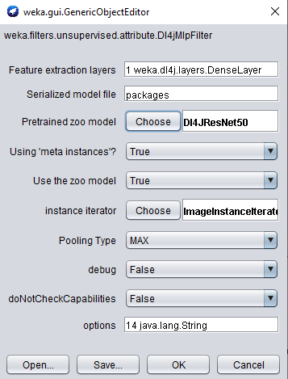
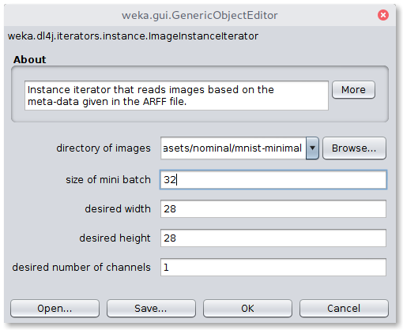
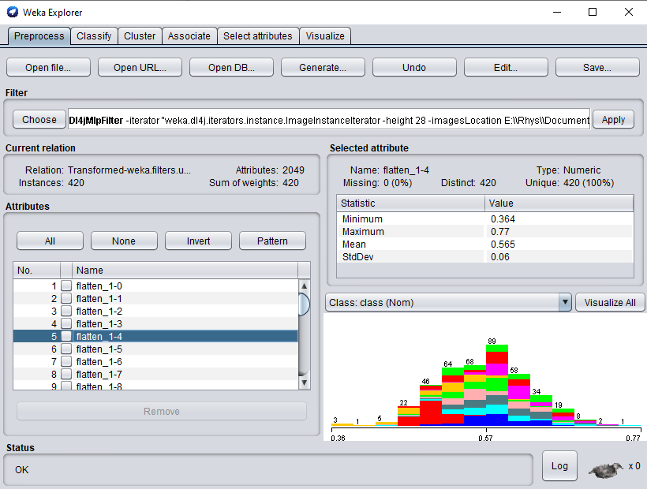
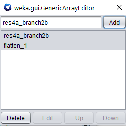
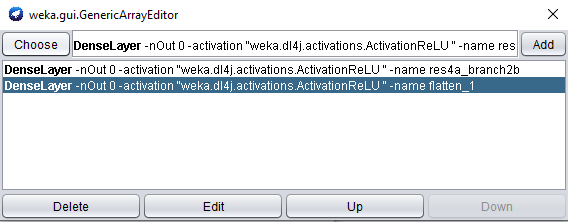
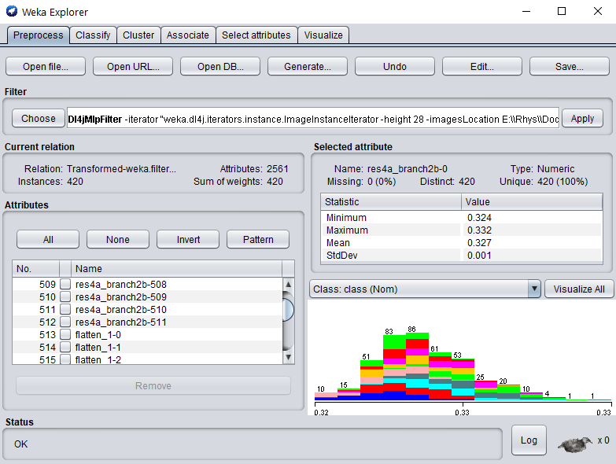

# The MNIST Dataset - Feature Extraction
  



Instead of training a full neural network on your dataset, you may like to try using a pretrained model 
as a feature extractor and fitting a more simple model to those features.

You can use any model you've trained within WEKA, or any pretrained model in the model zoo for this task;
try a few and see which works best for your task!

### Concatenating Activations
By default the filter takes features from the final dense/pooling layer of the model (before the classification layer). 
You can also take features from any intermediary layer and concatenate them.

### Activation Pooling 
An important parameter when using intermediate layers is the filter's `PoolingType`. 
Activations from intermediate layers are often 3-dimensional for a given instance, so they need
to be reduced into a 1-dimensional vector. 
There are 4 pooling methods currently supported:
- `PoolingType.MAX` (default)
- `PoolingType.AVG`
- `PoolingType.SUM`
- `PoolingType.MIN`
 
These pool the 2nd and 3rd dimension into a single value, i.e., activations of 
[512, 26, 26] (512 26x26 feature maps) are pooled into shape [512]. You can also specify `PoolingType.NONE`
which simply flattens the extra dimensions (aforementioned example would become shape [346112]). 
`PoolingType` does not need to be specified when using the default activation layer - the outputs are already the
 correct dimensionality.

## Example 1: Default MNIST Minimal
The following example walks through using a pretrained ResNet50 (from the Deeplearning4j model Zoo)
as a feature extractor on the MNIST dataset and fitting Weka's SMO algorithm to the dataset.
This only takes 1-2 minutes on a modern CPU &mdash; much faster than training a neural network from scratch.

The steps shown below split this into two steps; storing the featurized dataset, and fitting a Weka classifier to the dataset.
It can be combined into a single command with a filtered classifier, however, the method shown below
is more efficient as the dataset featurizing (which is the most expensive part of this operation) 
is only done once (would be done 10 times using 10-fold CV with a `FilteredClassifier`). Saving the featurized
dataset separately then makes it much faster to try out different Weka classifiers.

Note that the first time this is run it may need to download the pretrained weights, in which case actual runtime
will be longer. These weights are cached locally so subsequent runs are much faster.

### GUI

The first step is to open the MNIST meta ARFF file in the Weka Explorer `Preprocess` tab via `Open File`. 
A randomly sampled MNIST dataset of 420 images is provided in the WekaDeeplearning4j package for testing purposes 
(`$WEKA_HOME/packages/wekaDeeplearning4j/datasets/nominal/mnist.meta.minimal.arff`). 

Then, select the the `Dl4jMlpFilter` in the filter panel (within `filters/unsupervised/attribute`). 
Click in the properties box to open the filter settings.



To correctly load the images it is further necessary to select the `Image-Instance-Iterator` as `instance iterator` 
and point it to the MNIST directory that contains the actual image files (`$WEKA_HOME/packages/wekaDeeplearning4j/datasets/nominal/mnist-minimal/`). 

If running on CPU then set mini-batch size to your machine's thread count. 
If you run into memory issues then use a smaller mini-batch size. Click `OK` to exit the `ImageInstanceIterator` settings.



`Dl4jResNet50` is already selected as the feature extractor model, and will by default use the final dense layer
 activations as the image features.
The other filter options can be left as default; they'll be explained in the next example.

Click `Ok` and `Apply` to begin processing your dataset. After completion, you should see your newly processed dataset!



Simply switch to the `Classify` tab to start applying different WEKA classifiers to your newly transformed dataset. 

### Commandline
This example assumes that `weka.jar` is in the classpath and the current working directory is the root of the WekaDeeplearning4j folder
(`$WEKA_HOME/packages/wekaDeeplearning4j`).
```bash
$ java -Xmx8g weka.Run \
    .Dl4jMlpFilter \
        -i datasets/nominal/mnist.meta.minimal.arff \
        -o mnist-rn50.arff \
        -c last \
        -decimal 20 \
        -iterator ".ImageInstanceIterator -imagesLocation datasets/nominal/mnist-minimal -bs 12" \
        -zooModel ".Dl4JResNet50"
        -default-feature-layer
```
It should be noted that because we're using the default extraction layer (for this model) of `flatten_1`, we can simply specify the `-default-feature-layer`
flag. This is especially useful if trying a range of different zoo models and one wants to avoid specifying layer names for each one.
 
 We now have a standard `.arff` file that can be fit to like any numerical dataset
```bash
$ java weka.Run .SMO -t mnist-rn50.arff
```


### Java
This uses reflection to load the filter so all the DL4J dependencies don't need to be on the CLASSPATH - 
as long as WekaDeeplearning4j is installed from the Package Manager, weka.core.WekaPackageManager.loadPackages` will load
the necessary libraries at runtime.
```java
// Load all packages so that Dl4jMlpFilter class can be found using forName("weka.filters.unsupervised.attribute.Dl4jMlpFilter")
weka.core.WekaPackageManager.loadPackages(true);

// Load the dataset
weka.core.Instances instances = new weka.core.Instances(new FileReader("datasets/nominal/mnist.meta.minimal.arff"));
instances.setClassIndex(1);
String[] filterOptions = weka.core.Utils.splitOptions("-iterator \".ImageInstanceIterator -imagesLocation datasets/nominal/mnist-minimal -bs 12\" -poolingType AVG -layer-extract \".DenseLayer -name flatten_1\" -zooModel \".Dl4JResNet50\"");
weka.filters.Filter myFilter = (weka.filters.Filter) weka.core.Utils.forName(weka.filters.Filter.class, "weka.filters.unsupervised.attribute.Dl4jMlpFilter", filterOptions);

// Run the filter, using the model as a feature extractor
myFilter.setInputFormat(instances);
weka.core.Instances transformedInstances = weka.filters.Filter.useFilter(instances, myFilter);

// You could save the instances at this point to an arff file for rapid experimentation with other classifiers via:
// https://waikato.github.io/weka-wiki/formats_and_processing/save_instances_to_arff/

// CV our Random Forest classifier on the extracted features
weka.classifiers.evaluation.Evaluation evaluation = new weka.classifiers.evaluation.Evaluation(transformedInstances);
int numFolds = 10;
evaluation.crossValidateModel(new weka.classifiers.functions.SMO(), transformedInstances, numFolds, new Random(1));
System.out.println(evaluation.toSummaryString());
System.out.println(evaluation.toMatrixString());
``` 

### Results
Using `SMO` gives us 89% accuracy - certainly not SOTA but given the simplicity and speed of the method it's not bad!
It should be noted that the training dataset size is very small (~400 instances) and also that the `ResNet50` weights are trained on ImageNet, which is a very different domain to MNIST
(classifying cars, animals, etc. vs classifying handwritten digits).

```text
=== Stratified cross-validation ===
=== Summary ===

Correctly Classified Instances         374               89.0476 %
Incorrectly Classified Instances        46               10.9524 %
Kappa statistic                          0.8783
Mean absolute error                      0.1611
Root mean squared error                  0.2736
Relative absolute error                 89.4975 %
Root relative squared error             91.2069 %
Total Number of Instances              420     

=== Confusion Matrix ===

  a  b  c  d  e  f  g  h  i  j   <-- classified as
 39  0  0  2  0  0  0  0  0  0 |  a = 0
  0 46  1  0  0  0  0  0  0  0 |  b = 1
  2  0 37  0  0  0  1  0  1  0 |  c = 2
  1  0  0 40  0  1  0  0  0  2 |  d = 3
  1  1  1  0 36  0  0  0  0  2 |  e = 4
  0  0  0  3  0 33  0  1  1  0 |  f = 5
  0  0  0  0  0  0 41  0  0  0 |  g = 6
  0  0  0  2  1  0  0 38  0  3 |  h = 7
  1  0  0  2  0  4  0  1 32  1 |  i = 8
  1  0  1  0  3  1  0  4  0 32 |  j = 9
```

## Example 2: MNIST Using Activation Layer Concatenation and Pooling
This example shows concatenating the activations from an intermediary convolution layer (`res4a_branch2b`) 
to the default activations (from layer `flatten_1`) and using `PoolingType.AVG`
to average pool the extra dimensions from `res4a_branch2b`.

Check out the [model summary](../model-zoo/dl4j/DL4JResNet50.md) to look at other layers you could use.

### GUI
The first step is to open the MNIST meta ARFF file in the Weka Explorer `Preprocess` tab via `Open File`. 
A randomly sampled MNIST dataset of 420 images is provided in the WekaDeeplearning4j package for testing purposes 
(`$WEKA_HOME/packages/wekaDeeplearning4j/datasets/nominal/mnist.meta.minimal.arff`). 

Then, select the the `Dl4jMlpFilter` in the filter panel. Click in the box to open the filter settings.


To correctly load the images it is further necessary to select the `Image-Instance-Iterator` as `instance iterator` 
and point it to the MNIST directory that contains the actual image files (`$WEKA_HOME/packages/wekaDeeplearning4j/datasets/nominal/mnist-minimal/`). 

If you run into memory issues then use a smaller mini-batch size.


`Dl4jResNet50` is already selected as the feature extractor model. To add `res4a_branch2b` as another feature extraction layer, 
we first set the `Use default feature layer` flag to **false** - if this is not done, only the default
extraction layer will be used. To edit the `Feature extraction layers` property,
click the property to open the array editor, and click the `DenseLayer` specification to open the editor for our new layer.



When adding another feature extraction layer, only the `layer name` property needs to be set. 
Set the `layer name` property to `res4a_branch2b`.
Click `OK` and `Add` to add the newly created layer:



Note that the order of feature extraction layers may have an effect on accuracy obtained by a WEKA classifier.

Because we're using activations from an intermediary layer now, the `Pooling Type`
argument will be used (as explained at the beginning of this tutorial).
The default type is `MAX`, but for the sake of this tutorial we're going to use `AVG`,
so change the `Pooling Type` property to `AVG`. 

Click `Ok` on the filter properties and `Apply` to begin processing your dataset. 
After completion, you should see your newly processed dataset! 
The attributes are named after the layer they were derived from, so more investigation can be done around which layer provides the most informative features (e.g., using the `Select Attributes` panel in WEKA).



Simply switch to the `Classify` tab to start applying different WEKA classifiers (this example uses `SMO`) to the newly transformed dataset.  


### Commandline
```bash
$ java -Xmx8g weka.Run \
    .Dl4jMlpFilter \
        -i datasets/nominal/mnist.meta.minimal.arff \
        -o mnist-rn50-concat.arff \
        -c last \
        -decimal 20 \
        -iterator ".ImageInstanceIterator -imagesLocation datasets/nominal/mnist-minimal -bs 16" \
        -poolingType AVG \
        -zooModel ".Dl4JResNet50" \ 
        -layer-extract ".DenseLayer -name res4a_branch2b" \
        -layer-extract ".DenseLayer -name flatten_1"         
```
We now have a standard `.arff` file that can be fit to like any numerical dataset
```bash
$ java weka.Run .SMO -t mnist-rn50-concat.arff
```

### Java
```java
// Load all packages so that Dl4jMlpFilter class can be found using forName("weka.filters.unsupervised.attribute.Dl4jMlpFilter")
weka.core.WekaPackageManager.loadPackages(true);

// Load the dataset
weka.core.Instances instances = new weka.core.Instances(new FileReader("datasets/nominal/mnist.meta.minimal.arff"));
instances.setClassIndex(1);
String[] filterOptions = weka.core.Utils.splitOptions("-iterator \".ImageInstanceIterator -imagesLocation datasets/nominal/mnist-minimal -bs 12\" -poolingType AVG -layer-extract \".DenseLayer -name flatten_1\" -layer-extract \".DenseLayer -name res4a_branch2b\" -zooModel \".Dl4JResNet50\"");
weka.filters.Filter myFilter = (weka.filters.Filter) weka.core.Utils.forName(weka.filters.Filter.class, "weka.filters.unsupervised.attribute.Dl4jMlpFilter", filterOptions);

// Run the filter, using the model as a feature extractor
myFilter.setInputFormat(instances);
weka.core.Instances transformedInstances = weka.filters.Filter.useFilter(instances, myFilter);

// You could save the instances at this point to an arff file for rapid experimentation with other classifiers via:
// https://waikato.github.io/weka-wiki/formats_and_processing/save_instances_to_arff/

// CV our Random Forest classifier on the extracted features
weka.classifiers.evaluation.Evaluation evaluation = new weka.classifiers.evaluation.Evaluation(transformedInstances);
int numFolds = 10;
evaluation.crossValidateModel(new weka.classifiers.functions.SMO(), transformedInstances, numFolds, new Random(1));
System.out.println(evaluation.toSummaryString());
System.out.println(evaluation.toMatrixString());
```


### Results
Adding this extra layer increased the accuracy very slightly! 
Try playing around with some other layers/classifiers/pooling types to try improve the accuracy even further.

```text
=== Stratified cross-validation ===

Correctly Classified Instances         376               89.5238 %
Incorrectly Classified Instances        44               10.4762 %
Kappa statistic                          0.8836
Mean absolute error                      0.1611
Root mean squared error                  0.2736
Relative absolute error                 89.521  %
Root relative squared error             91.2207 %
Total Number of Instances              420     

=== Confusion Matrix ===

  a  b  c  d  e  f  g  h  i  j   <-- classified as
 39  0  1  1  0  0  0  0  0  0 |  a = 0
  0 46  1  0  0  0  0  0  0  0 |  b = 1
  1  0 37  1  0  0  1  0  1  0 |  c = 2
  1  0  1 39  0  1  0  0  0  2 |  d = 3
  0  1  1  0 37  0  0  0  0  2 |  e = 4
  0  0  0  2  0 34  0  1  1  0 |  f = 5
  1  0  0  0  0  0 39  0  1  0 |  g = 6
  0  0  0  1  1  0  0 39  1  2 |  h = 7
  1  0  1  2  0  1  0  1 33  2 |  i = 8
  1  0  0  0  3  1  0  4  0 33 |  j = 9

```