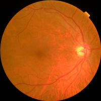
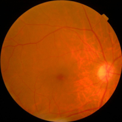
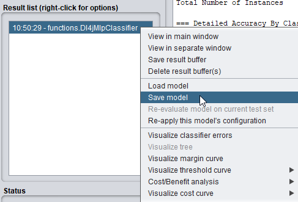
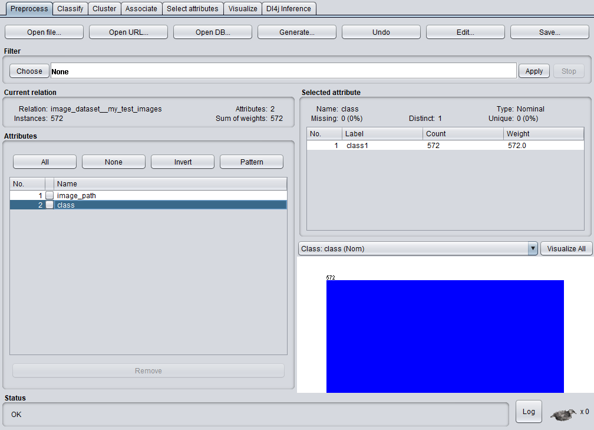
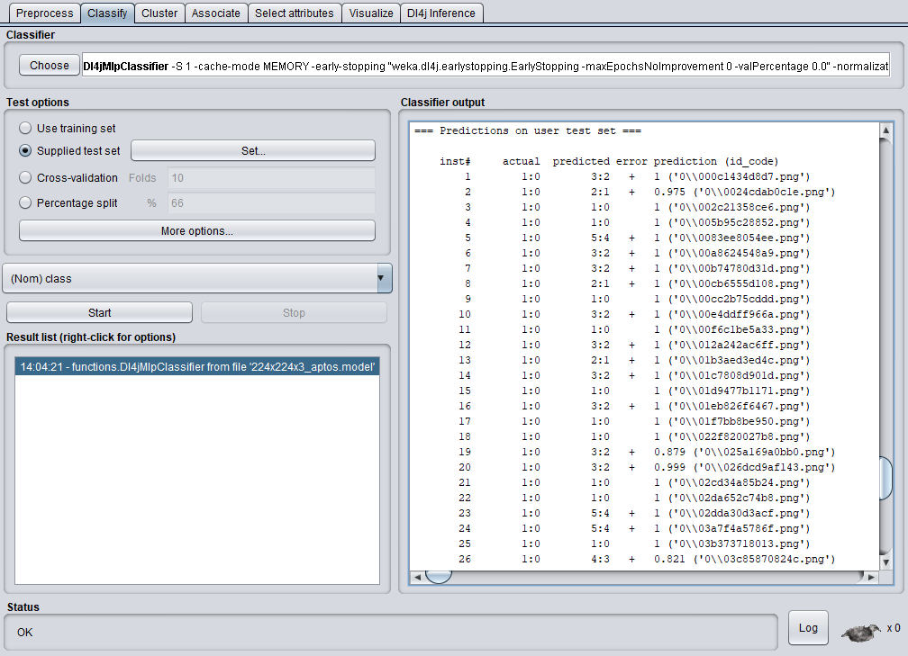

WekaDeeplearning4j includes a new `Dl4j Inference` panel, which allows you to easily run inference on images using either the built-in [Model Zoo](https://deeplearning.cms.waikato.ac.nz/user-guide/model-zoo/)
or a custom trained `Dl4jMlpClassifier` model. This panel doesn't require you to load an entire `.arff` dataset, so it's great for quick experimentation and prototyping.

For more in-depth experimentation, WekaDeeplearning4j allows you to generate a **saliency map** when running inference on an image. The map can show *what part of the image the model is 'looking'
at to make its prediction*.

This section walks through a few common usage scenarios with the panel, including simple inference and more advanced **saliency map** generation.

Where the examples below use an image, this can be found in the `test-images/` asset pack folder or the test images folder included with **WekaDeeplearning4j**:

    $WEKA_HOME/packages/wekaDeeplearning4j/src/test/resources/images/ 

All datasets/models referenced in this tutorial can be found in the [asset pack](introduction.md)

## Starting Simple - Inference with Default Parameters

The package has set reasonable default values for simple inference on images of everyday objects (animals, food, vehicles, etc.).

This example uses the built-in `Dl4jResNet50` model (pretrained
on IMAGENET) to perform prediction.

### GUI

After switching to the `Dl4j Inference` panel, we'll need to open an image
to run prediction on. We'll use `pufferfish.jpg` for this example,
although you can use any image saved to your machine.

- Click `Open Image...` and select the image file on your computer


To run inference on the image, simply click `Start`. After a brief pause you should see the
prediction results below the image:


As we can see, the model (`Dl4jResNet50`) has successfully predicted the image as that of a **Pufferfish**!

### Command Line

The model explorer can also be run from a command-line interface:

```bash
$ java weka.Run .Dl4jCNNExplorer \
    -i $WEKA_HOME/packages/wekaDeeplearning4j/src/test/resources/images/pufferfish.jpg
```

```bash
==================================================================
pufferfish.jpg - Dl4jResNet50

  Class ID |                              Class Name |     Prob %
------------------------------------------------------------------
       397 | puffer, pufferfish, blowfish, globefish |     99.806
       334 |                     porcupine, hedgehog |      0.032
       990 |         buckeye, horse chestnut, conker |      0.029
       328 |                              sea urchin |      0.024
       448 |                               birdhouse |      0.021
==================================================================
```

## Simple Inference with Custom Parameters

The previous example showed how with absolutely no configuration we can run a pretrained deep learning
model, but we may want to configure the model a little further. This example shows how to use
the `VGG16` model (pretrained on the `VGGFACE` dataset) to perform **celebrity face prediction**.

For the purposes of this tutorial, we'll use an image of **Ben Stiller** (`ben_stiller.jpg`)
to perform prediction on.

On the `Dl4j Inference` panel, open the `Dl4jCNNExplorer` settings:


- Choose `Dl4jVGG` as the `Pretrained zoo model`.
    - Open the `Dl4jVGG` settings and change the `Pretrained Type` from `IMAGENET` to `VGGFACE`.

      

- Open the `ModelOutputDecoder` settings and change `Built in class map` from `IMAGENET` to `VGGFACE`.

  

- Click `Ok` and `Start` to run the newly configured model on our image of Ben Stiller. You should
  see the results in the output panel, again correctly predicting the target class.


### Command Line

```bash
$ java weka.Run .Dl4jCNNExplorer \
    -decoder ".ModelOutputDecoder -builtIn VGGFACE" \
    -zooModel ".Dl4jVGG -variation VGG16 -pretrained VGGFACE" \
    -i $WEKA_HOME/packages/wekaDeeplearning4j/src/test/resources/images/ben_stiller.jpg
```

```bash
==========================================
ben_stiller.jpg - Dl4jVGG (VGG16)

  Class ID |      Class Name |     Prob %
------------------------------------------
       201 |     Ben Stiller |     61.892
      1982 |   Peter Capaldi |     23.735
       562 |   Dirk Benedict |      4.794
       918 |     Jake Cherry |      0.889
       200 |      Ben Miller |      0.687
==========================================
```

## Inference with Custom Trained Model





Although a very diverse dataset (IMAGENET) was used to train many of the built-in zoo models (meaning they can perform accurate prediction in a wide range of domains), you may instead have a custom-trained `Dl4jMlpClassifier` which you'd like to experiment with; the process is largely the same as above, with a few minor changes.

To save a model you've trained in WEKA, right click on the result and click `Save model` (or use the `-d` argument from the command-line).



Provided in the asset pack is a model trained on the [APTOS](https://www.kaggle.com/c/aptos2019-blindness-detection/) dataset. This contains a large set of retina images taken using fundus photography under a variety of imaging conditions, with the task of classifying an image severity between 0-4. Check out the [dataset page](https://www.kaggle.com/c/aptos2019-blindness-detection/) for more info.

The data and model for this section are under the `aptos-blindness/` asset pack folder. A subset of the images are provided but feel free to download the full dataset if you'd like to train your own model.

### GUI

On the `Dl4j Inference` panel, open the `Dl4jCNNExplorer` settings:

- Set `Use custom-trained model file` to `True`
- Open the `CustomModelSetup` settings
    - Select the supplied `224x224x3_aptos.model` file as the `Serialized model file`
    - Set the input `channels`, `width`, and `height` with the values used to train the model. These values will be identical to those set on the `ImageInstanceIterator` (in this case `3`, `224`, `224`, respectively).

      

We now need to configure the `ModelOutputDecoder` to correctly parse the model predictions and map the class IDs with the appropriate class name. Class maps can be in two forms:
1. **`.txt`** - Each class is specified on a new line (example below)
2. **`.arff`** - The `.arff` file used to train the model can be selected; the classes will be parsed from this.

*Sample `classmap.txt` for the Plant Seedlings dataset*
```text
Scentless Mayweed
Fat Hen
Cleavers
Loose Silky-bent
Common Chickweed
Small-flowered Cranesbill
Common wheat
Shepherds Purse
Sugar beet
Maize
Charlock
Black-grass
```

Configure the `ModelOutputDecoder`:
- Set `Built in class map` to `CUSTOM`
- Select `train_aptos.arff` as the `Class map file`

  

Just like the previous examples, the custom model can perform inference on any image, although for meaningful results you should run it on images in the domain it was trained on - a model trained to classify between different dog breeds isn't going to give accurate answers when given a chest x-ray!

- Open an image from the supplied **APTOS** dataset and click `Start` to perform prediction on it. You can check the supplied `.arff` file to verify the model's accuracy.

### Command Line

This assumes you're running the terminal from within the `aptos-blindness/` asset folder.

```bash
$ java weka.Run .Dl4jCNNExplorer \
    -i train_images/0083ee8054ee.png \
    -custom-model ".CustomModelSetup -channels 3 -height 224 -width 224 -model-file 224x224x3_aptos.model" \
    -decoder ".ModelOutputDecoder -builtIn CUSTOM -classMapFile train_aptos.arff" \
    -useCustomModel
```

## Inference on many images (Batch prediction)

The examples above show how to perform inference on a single image at a time, but you may wish to do inference on hundreds of images at once. This can either be done with some scripting and command-line invocation of the `Dl4jCNNExplorer`, but another way is to use Weka's `Re-evaluate model on current test set` feature. This will be faster as it only needs to load the model once, while invoking the `Dl4jCNNExplorer` will load the model for each image.

### GUI

Weka's evaluation function looks in the current working directory for the images. This has two implications:

1. The folder containing our test images to run inference on must be given the same name as that containing the training images (e.g., `train_images`).
2. We must open Weka from a specific folder - the one containing our `train_images` folder

To load the images in for the model we'll need to create an `.arff` file which points to each image. This is easy to do manually but for this tutorial we'll show how to use the `ImageDirectoryLoader` class to do so.

- Copy your images into a single folder nested inside another folder. The naming of the top-level folder must match the folder name used when training the model and the nested folder name must match one of the target classes, but it does not matter which, i.e.,:
    ```
    train_images
    |-- cat
        |-- image1.png
        |-- image2.png
        ...
        |-- image259.png
    ```
We first need to open the Weka GUI from the folder containing `train_images` (e.g., if the structure was `Documents/train_images/cat/image1.png`, the 'parent folder' will be `Documents`). These commands require `weka.jar` to be on the classpath ([setup instructions](1-introduction_setup.md#environment-variables)).
- Open a terminal and change into the 'parent folder' directory.
- Open the Weka GUI by running: `java weka.gui.GUIChooser`.
- Open the Weka Explorer.

We can now continue from within the Weka GUI.
- Open the top-level folder (`train_images`) with the `ImageDirectoryLoader` ([further instructions](./2-training.md#fine-tuning-a-model-on-a-custom-dataset)).

You should now see your images loaded into the Weka Explorer:


- Up the top right, click `Save` to save this `.arff` for use in later steps.

We will now set up the evaluation in the **Classify** panel, so switch to that.

- Right click in the `Result list` panel, and click `Load model`. Select your previously saved `.model` file.
- In `Test options`, select `Supplied test set` and load the `.arff` file you created a few steps earlier.

We'll now configure the evaluation output.
- Click `More options`
- Change `Output predictions` from `Null` to `PlainText` (or whichever format you prefer).
- In the `PlainText` options, enter `first-last` to output all attributes for each instance (this includes the filename, which you may want for further processing.


- Click Ok, right click your loaded model in the `Result list` panel, and click `Re-evaluate model on current test set`.

Your model will begin inference on all images specified in the `.arff` you loaded as the test set. The results will be shown in the `Classifier output` panel:



You can ignore the `actual` column, as this is simply whichever class you named the nested folder. The `predicted` column denotes the models predictions in the format (`<class ID>:<class name>`). You can use this output for further sorting & processing.

## Saliency Map Generation

After running prediction on your image, you may be left wondering what *specifically* the model was looking at to make its prediction - a saliency map can help explain this.

WekaDeeplearning4j currently contains the **ScoreCAM** saliency map generation technique, which essentially copies the original image hundreds of times, masks each image differently, measures how strong the model predicts the target class for each masked image, and uses this to create a weighted combination. The idea being that masked images showing *important* parts of the image will produce a strong signal for the target class and therefore be weighted more heavily.

Because the model must perform inference on hundreds of images, the process can take much longer (2-3 minutes) than simple prediction. This can be sped up with the use of a modern GPU ([setup instructions](https://deeplearning.cms.waikato.ac.nz/install/#add-gpu-support)).

For the purpose of this tutorial, we'll use **ResNet 101** to perform prediction and generate the saliency map. Saliency map generation for custom-trained models is supported but currently in beta and not guaranteed to provide meaningful results.

### GUI

- In the `Dl4jCNNExplorer` settings, **set `Generate Saliency Map` to `true`**.
- Set `Use custom-trained model file` to `False`
- Open the `WekaScoreCAM` settings and set `Batch size` to 8 (or your number of CPU cores).
    - This allows **batches** of masked images to be passed through the model, decreasing
      saliency map generation time.
- Choose `KerasResNet` as the `Pretrained zoo model` and set the `Model Variation` to `RESNET101`.
- Ensure the `ModelOutputDecoder` is using `IMAGENET` as the built-in classmap.

From the tutorial image folder (`test-images`), open `catAndDog.jpg`, then click `Start` to begin processing.


After processing is finished, you should see the predictions in the `Model Output` panel,
and the **Saliency Map Viewer** window will automatically open (or click `View Saliency Map...`).

The default target class is the highest probability prediction (in this case `Golden Retriever`).
Click `Generate` to generate the saliency map for this target class.

The saliency map will be displayed (center) as well as superimposed on the original image (right):


As we can see, the model *is* focusing on the dog for its prediction.

#### Multiple Target Classes

The saliency map viewer allows you to select *multiple* target classes and display them alongside
each other.

- Click `Add Class` to add another target class.
- We now want to target the cat separately, so click `Pattern` and enter `.*tabby.*` to find
  the target class for a tabby cat.
    - If you know the class ID directly you can also enter that in the `Target Class ID` field.
      (or check the [class map lookup tables](#class-map-lookup-tables))
- Click `Generate` to create saliency maps for both classes:


As we can see, the model is correctly looking at either animal to make its prediction, depending
on whether we're targeting the dog or cat!

##### Class Map Lookup Tables

- [IMAGENET](https://deeplearning.cms.waikato.ac.nz/user-guide/class-maps/IMAGENET)
- [IMAGENET - Darknet 19](https://deeplearning.cms.waikato.ac.nz/user-guide/class-maps/DARKNET_IMAGENET) - Darknet19 was pretrained
  on an altered version of IMAGENET, hence the different class map.
- [VGGFACE](https://deeplearning.cms.waikato.ac.nz/user-guide/class-maps/VGGFACE)

### Command Line

To generate a saliency map from the command line, you must specify an output image location.
When specifying a target class, we can specify it as `-1`; the saliency map generator
will simply use the max probability class as the target class in this case. This is useful when you don't
know what the class ID may be.

```bash
$ java weka.Run .Dl4jCNNExplorer \
    -i "$WEKA_HOME/packages/wekaDeeplearning4j/src/test/resources/images/catAndDog.jpg" \
    -generate-map \
    -saliency-map ".WekaScoreCAM -bs 8 -normalize -output output_image.png -target-classes -1" \
    -zooModel ".KerasResNet -variation RESNET101"
```

#### Multiple Classes

```bash
$ java weka.Run .Dl4jCNNExplorer \
    -i "$WEKA_HOME/packages/wekaDeeplearning4j/src/test/resources/images/catAndDog.jpg" \
    -generate-map \
    -saliency-map ".WekaScoreCAM -bs 8 -normalize -output output_image.png -target-classes -1,281" \
    -zooModel ".KerasResNet -variation RESNET101"
```

## Experimentation Time

The `Dl4j Inference` panel is made for playing around, so get your hands dirty. Here are some suggestions for things to play around with.

- Try downloading some images of household objects of the internet and pass them in to one of the pretrained models - does it struggle on some particularly complex cases?
- Find a picture of your favourite celebrity, set up the `Dl4jCNNExplorer` for [celebrity prediction](#simple-inference-with-custom-parameters), and see if the model can correctly predict who they are. You may need to check the [VGGFACE](https://deeplearning.cms.waikato.ac.nz/user-guide/class-maps/VGGFACE) class map to ensure your chosen celebrity is in the dataset.
- Make sure to try out different models in the Model Zoo. Some are much larger than others, but can provide more accurate predictions.

## The End

Congratulations! You've completed the **WekaDeeplearning4j** Tutorial!