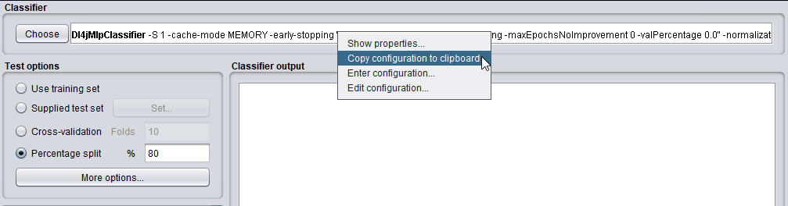

# Introduction & Setup

Download the asset pack from [Github](https://github.com/Waikato/wekaDeeplearning4j/releases/download/asset-pack/WDL4J-Assets.zip) and extract it somewhere easily accessible on your machine - you'll be referring to this folder many times throughout the tutorial.
We'll refer to it as `$ASSET_FOLDER` during the examples.

All datasets, images, and models referenced throughout the tutorial can be found in this asset pack.

## Environment Variables

The command-line examples in this tutorial assume a few environment variables are set. You can ignore these if you only wish to use the GUI.

- `WEKA_HOME`: This variable should point to the location of your WEKA installation, e.g., `/home/rhys/weka-3.8.4`. It's used for some commands in this tutorial and by the `install-cuda-libs` script to install the CUDA libraries for WEKA.
- `CLASSPATH`: Java uses this variable to locate and load classes at runtime. This can be manually specified for each command-line run but this becomes arduous to do every time, so it's recommended to set this environment variable permanently (at least for the duration of this tutorial). This variable should point to the location of `weka.jar` on your machine - typically inside the WEKA installation directory, e.g., `$WEKA_HOME/weka.jar`.

## General Tips

### Running WEKA from the Command Line

A common workflow is to experiment with different models/hyperparameters in the **WEKA Explorer** on a small subset of the data,
then run the final configuration with the full dataset on a more powerful headless server. Figuring out the correct command-line syntax on the server directly can be difficult, especially for complex models, so WEKA has a `Copy configuration to clipboard` function.

1. Set up your configuration in the **WEKA Explorer** window (e.g., on your local machine), then right click and click `Copy configuration to clipboard`:

   
   
2. Paste this into the command line (e.g., on your association's machine learning servers), specifying any other flags necessary for `weka.Run` that aren't included in the pasted configuration. For example training a `Dl4jMlpClassifier` can be done like:

    ```bash
    $ java weka.Run <Dl4jMlpClassifier configuration from clipboard> \
        -t <.arff file previously loaded into Weka> \
        -d <output model file path> \
        -split-percentage 80
    ```
