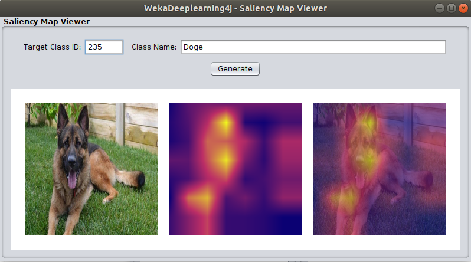

# Dl4j Model Inference - ScoreCAM

The tutorial walks through the steps required to use a pretrained model with the new `Dl4j Inference` panel.

## GUI

You'll first need to open an image to run prediction on. 
The package includes a few test images in `src/test/resources/images/`; 
we'll use `dog.jpg` for this example.

After **opening the image** we need to configure the `Dl4jCNNExplorer` to generate a saliency map.
Click on the `Dl4jCNNExplorer` panel to open the settings and **set `Generate Saliency Map` to `true`**.

Click on the `WekaScoreCAM` panel to open its properties and **set the batch size to 8** (or whatever your CPU core count is).

For this tutorial we'll simply use the default pretrained model (`Dl4jResNet50`).

Click `Ok` to save those settings and `Predict` to start running inference.
Generating a *ScoreCAM* saliency map requires running inference on hundreds of perturbed versions of the original image,
so it will take a few minutes to process (simply running inference without `Generate Saliency Map` completes in a few seconds).

Once finished, you should see the predictions in the `Model Output` panel.

To view the saliency map, click `View Saliency Map...`, input the target class you'd like to generate for
(typically the highest probability class ID shown in the `Model Output`), and click `Generate`.

Within a few seconds you should see your saliency map shown (center) as well as superimposed on the 
original image (right):

