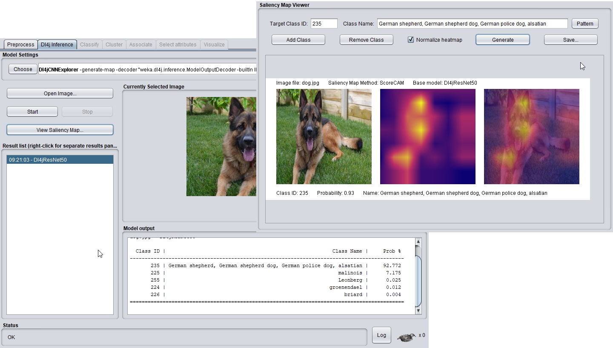
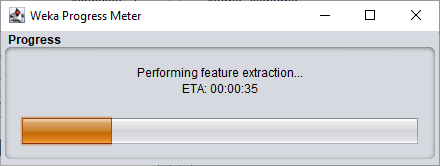

# WekaDeeplearning4j: Deep Learning using Weka


WekaDeeplearning4j is a deep learning package for the [Weka](https://www.cs.waikato.ac.nz/ml/weka/index.html) workbench. It is developed to incorporate the modern techniques of deep learning into Weka. The backend is provided by the [Deeplearning4j](https://deeplearning4j.org/) Java library. 

The source code for this package is available on [GitHub](https://github.com/Waikato/wekaDeeplearning4j). The java-doc can be found [here](https://waikato.github.io/wekaDeeplearning4j/).

## Functionality
All functionality of this package is accessible via the Weka GUI, the commandline and programmatically in Java.

The following Neural Network Layers are available to build sophisticated architectures:
 
- **ConvolutionLayer**: applying convolution, useful for images and text embeddings
- **DenseLayer**: all units are connected to all units of its parent layer
- **SubsamplingLayer**: subsample from groups of units of the parent layer by different strategies (average, maximum, etc.)
- **BatchNormalization**: applies the common batch normalization strategy on the activations of the parent layer
- **LSTM**: uses long short term memory approach
- **GlobalPoolingLayer**: apply pooling over time for RNNs and pooling for CNNs applied on sequences
- **OutputLayer**: generates classification / regression outputs

Further configurations can be found in the [Getting Started](user-guide/getting-started.md) and the [Examples](examples) sections.


## New Release (1.7.0)



### Dl4j Inference Panel & Dl4jCNNExplorer
One major addition in **WekaDeeplearning4j** v1.7.0 is the new **Dl4jCNNExplorer** and the 
associated GUI **Dl4j Inference Panel**. This brings real-time inference to the WEKA universe, 
allowing you to quickly run an image classification CNN model on an image without having to 
load an entire `.arff` file.

The **Dl4jCNNExplorer** supports both a custom-trained `Dl4jMlpClassifier` and a model from 
the Model Zoo, so it can be used to verify your model's prediction capabilities 
or simply play around with pretrained models and explore what state-of-the-art 
architectures may work best for your domain.

Check out the [usage example](examples/dl4j-inference.md) 
to see how easy it is to get started.

### Saliency Map Generation with ScoreCAM
Another exciting new feature is the implementation of **ScoreCAM**, a saliency map generation technique. 
This can be accessed through the `Dl4jCNNExplorer`, allowing you to not only perform prediction on an image, 
but look at *what* in the image your model was using for prediction.

This can be invoked from the command-line, although the best user experience is to be had from the GUI using the 
**Saliency Map Viewer**, which allows you to quickly customize the ScoreCAM target classes.

Check out the [usage example](examples/dl4j-inference.md#example-4-saliency-map-generation) 
to see what new insights can be brought to your workflow.

### Progress Manager



We've created a simple---but effective---progress bar and added this to the long-running tasks 
(model training, feature extraction, etc.). This provides a graphical indicator of progress and remaining 
ETA for the current job so will make WEKA more usable for large jobs.

### Model Summaries

We've also added [model summaries](user-guide/model-zoo.md#model-summaries) 
to the documentation, which specify the different models and their layers. This can be useful for designing 
your own architectures or with the `Dl4jMlpFilter`, when using intermediary layers for feature extraction.

## Citation

Please cite the following paper if using this package in an academic publication:

S. Lang, F. Bravo-Marquez, C. Beckham, M. Hall, and E. Frank  [WekaDeeplearning4j: a Deep Learning Package for Weka based on  DeepLearning4j](https://www.sciencedirect.com/science/article/pii/S0950705119301789),  In *Knowledge-Based Systems*, Volume 178, 15 August 2019, Pages 48-50. DOI: 10.1016/j.knosys.2019.04.013  ([author version](https://felipebravom.com/publications/WDL4J_KBS2019.pdf))

BibTex:

```
@article{lang2019wekadeeplearning4j,
  title={WekaDeeplearning4j: A deep learning package for Weka based on Deeplearning4j},
  author={Lang, Steven and Bravo-Marquez, Felipe and Beckham, Christopher and Hall, Mark and Frank, Eibe},
  journal={Knowledge-Based Systems},
  volume = "178",
  pages = "48 - 50",
  year = "2019",
  issn = "0950-7051",
  doi = "https://doi.org/10.1016/j.knosys.2019.04.013",
  url = "http://www.sciencedirect.com/science/article/pii/S0950705119301789",
  publisher={Elsevier}
}
```

## Contributing
Contributions are always welcome. If you want to contribute to the project, check out our [contribution guide](https://github.com/Waikato/wekaDeeplearning4j/blob/master/CONTRIBUTING.md).

### Future Work
Future work on WekaDeeplearning4j will include network weight and activation visualization, and support for multiple embeddings as input channels for textual data.
