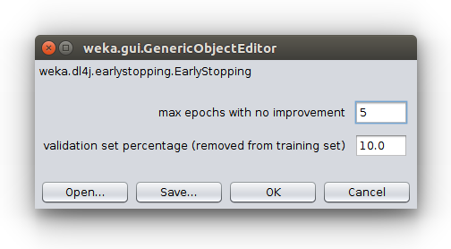

# Model Zoo

WekaDeeplearning4J contains a wide range of popular architectures, ready to use either for training or as feature extractors.
The table below outlines the different models included, whether pretrained weights are available, the types of pretrained weights,
and the model variations (if any). WekaDeeplearning4j merges the model zoo of Deeplearning4j *and* Keras.

| Framework | Model             | Pretrained Implemented | Weights Available         | Varieties                                |
|-----------|-------------------|------------------------|---------------------------|------------------------------------------|
| DL4J      | AlexNet           | No                     | -                         | -                                 |
| DL4J      | Darknet19         | Yes                    | ImageNet                  | 224x224 or 448x448 input size      |
| DL4J      | FaceNetNN4Small2  | No                     | -                         | -                                 |
| DL4J      | InceptionResNetV1 | No                     | -                         | -                                 |
| DL4J      | LeNet             | Yes                    | MNIST                     | -                                 |
| DL4J      | NASNet            | No                     | ImageNet, ImageNet Large  | -                                 |
| DL4J      | ResNet50          | Yes                    | ImageNet                  | -                                 |
| DL4J      | SimpleCNN         | No                     | -                         | -                                 |
| DL4J      | SqueezeNet        | Yes                    | ImageNet                  | -                                 |
| DL4J      | VGG16             | Yes                    | ImageNet, VGGFace         | -                                 |
| DL4J      | VGG19             | Yes                    | ImageNet                  | -                                 |
| DL4J      | XCeption          | Yes                    | ImageNet                  | -                                 |
| Keras     | DenseNet          | Yes                    | ImageNet                  | 121, 169, 201                            |
| Keras     | InceptionV3       | Yes                    | ImageNet                  | -                                 |
| Keras     | NASNet            | Yes                    | ImageNet                  | Mobile, Large                            |
| Keras     | ResNet            | Yes                    | ImageNet                  | 50, 50V2, 101, 101V2, 152, 152V2         |
| Keras     | VGG               | Yes                    | ImageNet                  | 16, 19                                   |
| Keras     | Xception          | Yes                    | ImageNet                  | -                                 |

The EfficientNet family of models will be added soon.

To set a predefined model, e.g. ResNet50, from the model zoo, it is necessary to add the `-zooModel "weka.dl4j.zoo.ResNet50"` option via commandline, or call the `setZooModel(new ResNet50())` on the `Dl4jMlpClassifier` object.
DL4J's DarkNet19 model has two variations, however, to set this one must set the image `width` and `height` to `448`, otherwise the default `224` size will be used.

Model names from Keras are prepended with `Keras`, i.e., `KerasResNet`.
In addition, some Keras models support different variations. These can be set via `.setVariation()` e.g.:

```java
KerasResNet kerasResNet = new KerasResNet();
kerasResNet.setVariation(ResNet.VARIATION.RESNET101V2);
```

**Commandline** TODO
```bash

```

**Java**
```java

```
**GUI**


