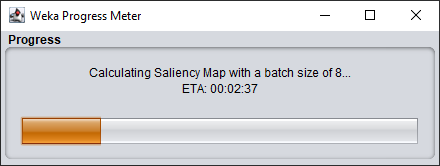
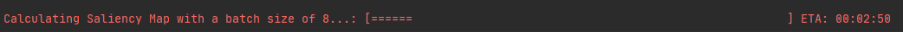
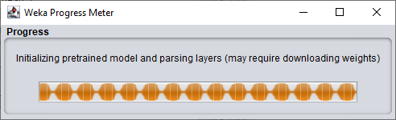

# Progress Manager

As the name suggests, the progress manager is a class which can manage the 
display of task progress to the user, either through a GUI popup window or
in the command-line, depending on how Weka is being run. 
The class calculates an ETA for the task, calculated on the current
iteration speed. 





In addition to iterative tasks (e.g., training a model for `n` iterations),
the progress manager can be used for *indeterminate* tasks - those without
a clear number of iterations/notion of progress.



## Usage Examples

### Iterative Progress Bar

```java
class ProgressManagerIterative {
    public void buildClassifier() {
        int numIterations = 10;
        ProgressManager progressMgr = new ProgressManager(numIterations, "Training Dl4jMlpClassifier...");
        progressMgr.start();
        for (int i = 0; i < numIterations; i++) {
            // Train classifier for iteration
            runIteration();
            // Update the progress manager
            progressMgr.increment();
        }
        // Close out the progress bar
        progressMgr.finish();
    }
}
```

### Indeterminate Progress Bar

```java
class ProgressManagerIndeterminate {
    public void loadModelWithProgressManager() {
        // Initializing without a specified number of iterations sets the manager to indeterminate mode
        ProgressManager progressMgr = new ProgressManager("Initializing pretrained model and parsing layers");
        progressMgr.start();
        
        loadWeightsFromModel();

        progressMgr.finish();
    }
}
```


